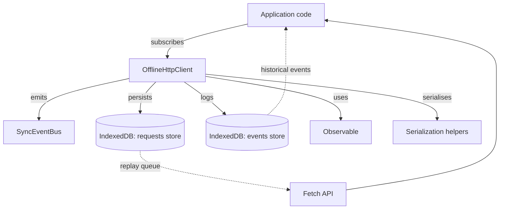
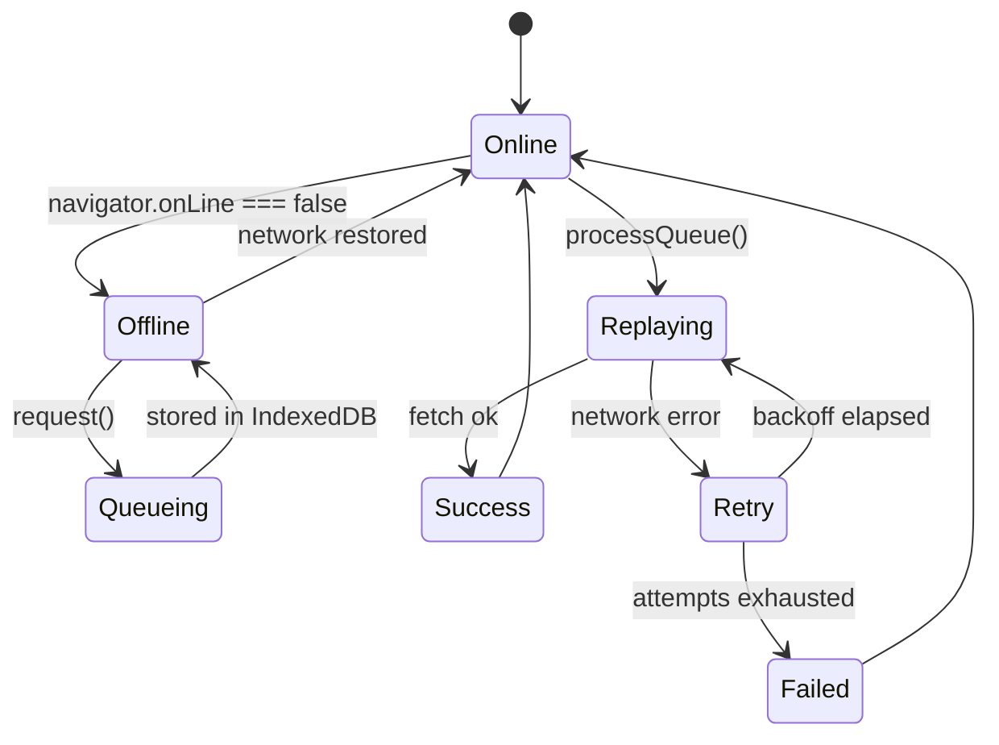
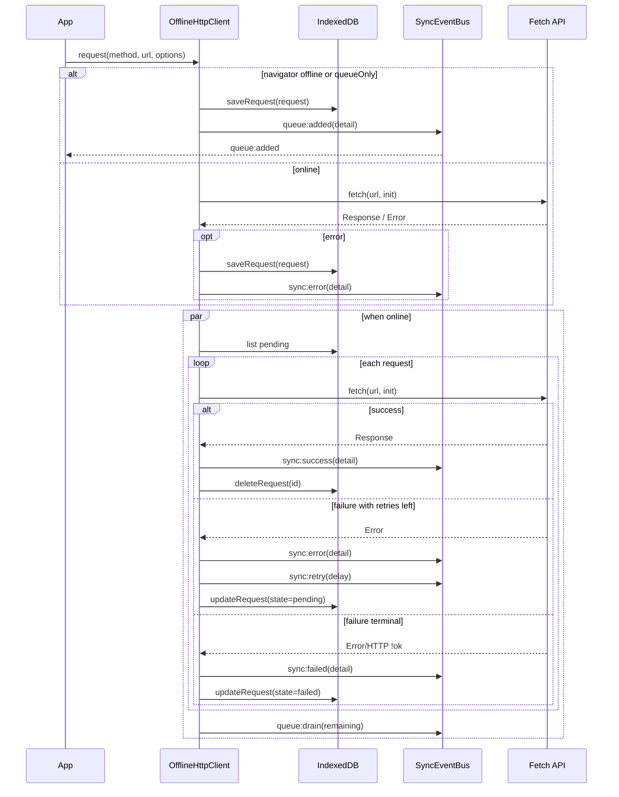

# Architecture Overview

## High-level components

## Offline to online flow

## Sequence: offline request replay

## Data persistence

- **Requests store**: `StoredRequest` records containing HTTP method, URL, serialised body, headers, metadata, retry policy, attempt counters, timestamps, and last error.
- **Events store**: chronological event log for auditability and UI reconstruction. Each event stores the payload dispatched through the runtime event bus.

## Error surface and recovery

- Immediate online errors surface to the request observable *and* `sync:error` events (with `willRetry = false`).
- Offline/queued errors surface through events only, ensuring UIs reopened later can rehydrate context.
- Failed requests remain in IndexedDB with `state = failed`. Applications can inspect them via `getFailedRequests()` and resubmit by calling `retryFailed([...ids])`.
