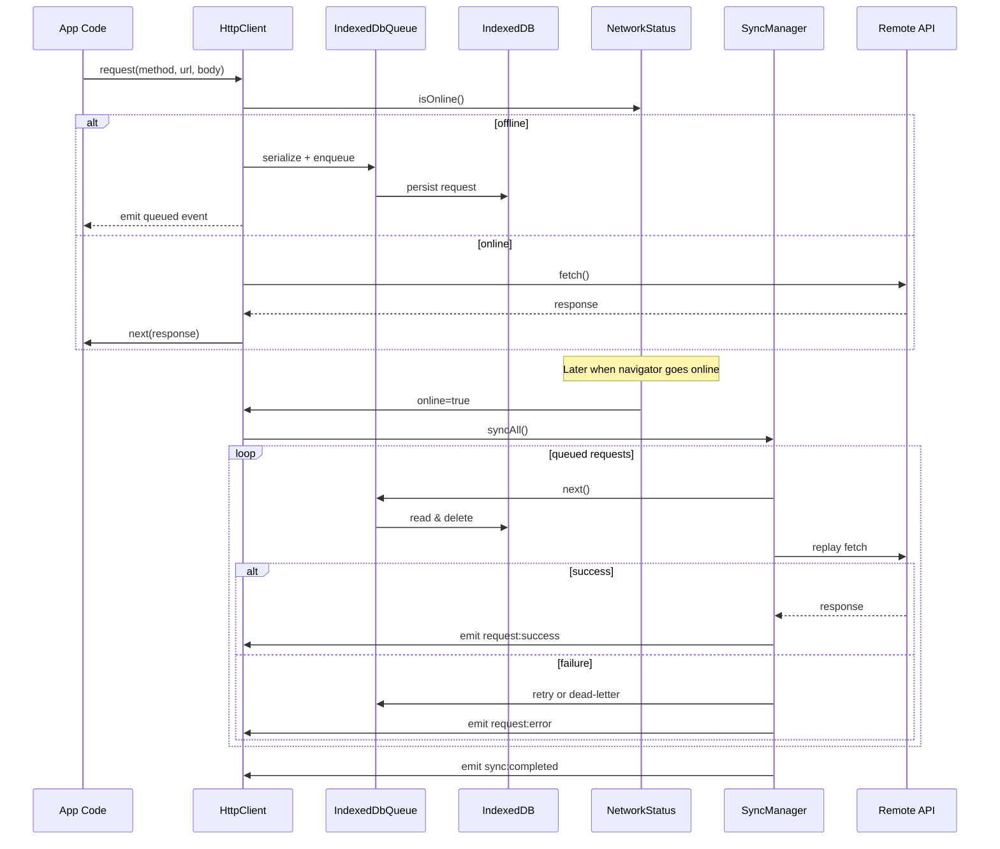

# Offline HTTP Helper Architecture

## Component Diagram

```mermaid
digraph G {
  rankdir=LR;
  subgraph cluster_client {
    label = "Application";
    Consumer["App Code"];
    UI["UI / Mobile Shell"];
  }

  subgraph cluster_library {
    label = "Offline HTTP Helper";
    HttpClient;
    EventBus["HttpEventBus"];
    Queue["IndexedDbQueue"];
    SyncManager;
    Network["NetworkStatus"];
    Serialization["Serialization Utils"];
  }

  subgraph cluster_browser {
    label = "Browser Runtime";
    IndexedDB;
    FetchAPI["fetch"];
    Navigator["navigator.onLine"];
  }

  Consumer -> HttpClient;
  HttpClient -> EventBus;
  HttpClient -> Queue;
  HttpClient -> SyncManager;
  HttpClient -> Network;
  SyncManager -> Queue;
  SyncManager -> EventBus;
  SyncManager -> FetchAPI;
  Queue -> IndexedDB;
  Network -> Navigator;
  HttpClient -> FetchAPI;
  EventBus -> UI;
}
```

## Sequence Diagram — Offline to Online Replay



## Error Propagation Flow

```mermaid
digraph Errors {
  rankdir=LR;
  RequestFailure["Fetch Failure / HTTP Error"];
  SyncManager;
  HttpClient;
  EventBus;
  Consumer["App Event Listener"];
  DeadLetter["Dead Letter Store"];

  RequestFailure -> SyncManager;
  RequestFailure -> HttpClient;
  SyncManager -> EventBus [label="request:error"];
  HttpClient -> EventBus [label="request:error"];
  SyncManager -> DeadLetter [label="max retries"];
  EventBus -> Consumer [label="CustomEvent"];
}
```

## Recovery Strategies

1. **Transient failures** (e.g., network hiccups) are retried up to `maxRetries` automatically. The consumer can display a "retrying" banner by listening to `request:error` events where `event.detail.error.retriable === true`.
2. **Permanent failures** emit `request:permanent-failure` and are moved to a dead-letter store. Consumers can surface a task list and allow the user to re-submit after resolving the issue.
3. Consumers may call `client.triggerSync()` to force a replay (for example after credentials are refreshed).
4. `client.listQueuedRequests()` and `client.listDeadLetters()` expose stored requests for advanced recovery UIs.

## Data Persistence Considerations

- Request bodies are serialized to JSON, text, base64 blobs, or structured form data before storage.
- Metadata such as headers, retry counts, and timestamps are preserved so that replays behave identically to the original request.
- File uploads are converted to base64 strings; upon replay they are reconstructed into `Blob` instances.
- FormData submissions are deconstructed into key/value pairs where each value is serialized recursively, allowing nested blobs and text.
- Application-specific metadata can be attached to each request via the `metadata` field so that domain workflows (e.g., linking offline photos to a work order) survive process restarts.
