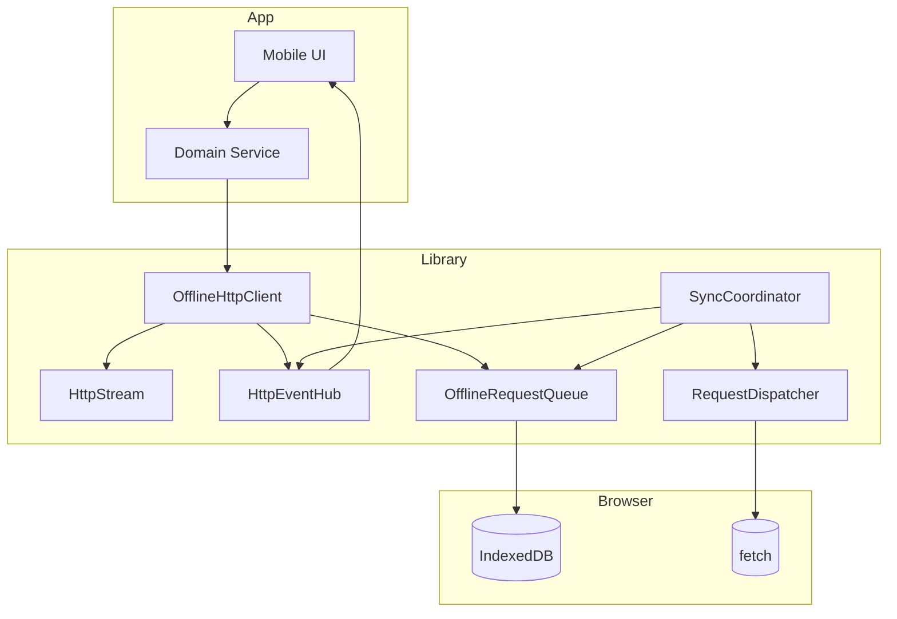
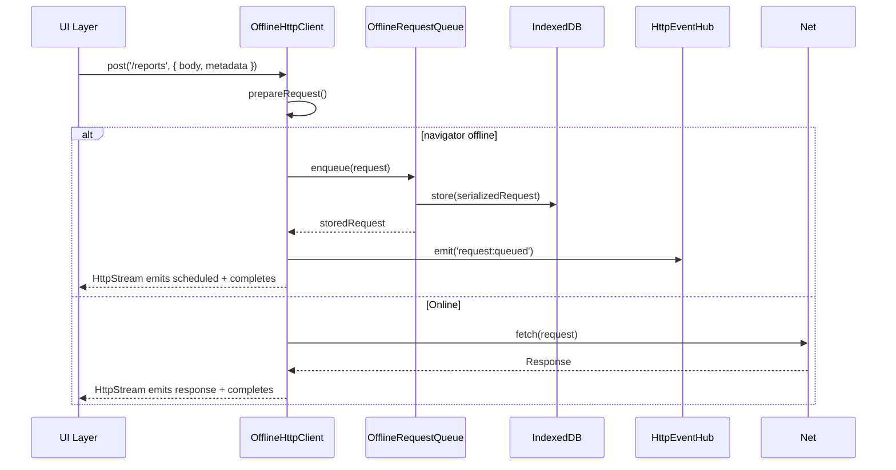

# Architecture

This document describes how the offline HTTP helpers persist work while offline and replay it safely once a connection is restored.

## Component view



* **OfflineHttpClient** orchestrates stream creation, queueing, and dispatching.
* **HttpStream** mimics an RxJS observable, emitting `scheduled`, `response`, `retry`, and `error` events.
* **OfflineRequestQueue** serializes request state (method, headers, payload, metadata) into IndexedDB so it survives restarts.
* **SyncCoordinator** drains the queue, applies retry/back-off policies, and surfaces lifecycle events.
* **RequestDispatcher** performs the actual `fetch` call and parses the response according to the stored response type or parser key.

## Offline submission sequence



When offline, the stream informs the caller that the work has been scheduled and completes immediately. The durable `request:queued` event lets the app reflect queued work even after a restart.

## Replay and recovery sequence

```mermaid
sequenceDiagram
  participant Sync as SyncCoordinator
  participant Queue as OfflineRequestQueue
  participant DB as IndexedDB
  participant Dispatcher as RequestDispatcher
  participant Events as HttpEventHub

  loop On connectivity
    Sync->>Queue: list(pending)
    Queue->>DB: cursor(status=pending)
    Queue-->>Sync: pendingRequests
    alt Request succeeds
      Sync->>Dispatcher: execute(request)
      Dispatcher->>Net: fetch
      Net-->>Dispatcher: response
      Dispatcher-->>Sync: data + response
      Sync->>Queue: delete(id)
      Sync->>Events: emit('request:sync-success')
    else Request fails
      Sync->>Dispatcher: execute(request)
      Dispatcher->>Net: fetch
      Net-->>Dispatcher: error/response >=500
      Dispatcher-->>Sync: throw error
      Sync->>Queue: update(status=pending, retries++, lastError)
      Sync->>Events: emit('request:sync-error', willRetry=true)
      Note over Sync: Wait based on retryDelays
      Sync->>Queue: get(id)
      Queue-->>Sync: request
      Sync: retry loop
    end
  end
  alt Retries exhausted
    Sync->>Queue: update(status=failed)
    Sync->>Events: emit('request:failed', willRetry=false)
  end
```

Apps can listen for `request:sync-error` to show progress or for `request:failed` to prompt the worker for manual intervention. Using `client.retry(id)` places the item back into the pending state so the coordinator can attempt it again.

## Data serialization strategies

* **JSON bodies** – Persisted as structured JSON and re-stringified on replay. The helper automatically sets `Content-Type: application/json` when needed.
* **FormData** – Stored as an array of entries. Binary parts keep their `Blob` representation plus filename metadata, so uploads (photos, signatures) remain intact.
* **Blob / File / ArrayBuffer** – Stored using the browser's structured clone support and reconstructed during dispatch.
* **URLSearchParams** – Stored as the encoded query string.
* **Metadata** – Any JSON-serializable metadata rides alongside the request so the UI can contextualize sync progress or prompt for recovery actions.

## Error propagation

Errors are surfaced in two ways:

1. **Per-request streams** emit an `error` event only when the helper cannot queue or dispatch the request. Once the work is queued, the stream completes to keep resource usage minimal.
2. **Event hub events** (`request:sync-error`, `request:failed`) inform the UI about background sync outcomes so it can present durable notifications after the worker reopens the app.

This separation keeps per-call code simple while enabling robust UX patterns for the offline/online transition.
